# Williams Sound Explorer — User Manual

A guided tour for hearing, watching, and tweaking the sound effects of three classic Williams arcade games:

- **Defender** (1980, Eugene Jarvis) — the first Williams arcade with the dedicated sound board.
- **Stargate / Defender II** (1981, Eugene Jarvis) — same hardware, mostly the same sound ROM.
- **Robotron 2084** (1982, Eugene Jarvis + Larry DeMar) — same board, doubled ROM, three new engines.

All three games drive a Motorola 6802 ("sound CPU") at 894 886 Hz that runs a tiny 2 KB (Defender/Stargate) or 4 KB (Robotron) program by Sam Dicker. There's no FM chip, no sample bank, no wave-table chip. **Every sound is a few dozen lines of 6800 assembly poking byte values into an 8-bit DAC.** The explorer makes that program visible, audible at slow motion, and editable in real time.

Background reading: [`docs/sound_hardware_model.md`](docs/sound_hardware_model.md) for the board's signal chain, [`docs/synthesis_techniques.md`](docs/synthesis_techniques.md) for the eight DSP primitives the engines share, [`docs/defender_sound_catalogue.md`](docs/defender_sound_catalogue.md) / [`docs/stargate_sound_catalogue.md`](docs/stargate_sound_catalogue.md) / [`docs/robotron_sound_catalogue.md`](docs/robotron_sound_catalogue.md) for every command code, [`docs/sound_studio_reference.md`](docs/sound_studio_reference.md) for prior art (zapspace's Defender Sound Studio).

---

## 0. Quickstart (60 seconds)

1. `cd explorer && npm install && npm run dev` — opens http://localhost:5173.
2. **Supply a sound ROM.** The explorer ships no copyrighted ROM bytes, so on first run an onboarding screen asks you to drop in the Williams *sound* ROM for each game (from a MAME romset you're licensed to use, dumped from your own board, or built with `tools/build_roms.sh`). Files stay in your browser (IndexedDB) — nothing is uploaded. Each slot validates the file and shows its SHA-1; the app works with as few as one ROM. Click **Enter the explorer**. *(Local dev shortcut: `npm run dev:roms` copies your `tools/*_sound.bin` into the gitignored `public/roms/` so the app auto-loads them and skips onboarding.)*
3. With Defender loaded, in the **Playback** section click the chip labelled `$11 LITE` (cyan dot). You'll hear the Defender lightning sound (~700 ms) — the very first sound the explorer was built to verify.
4. The waveform in **Ear** (the full-width oscilloscope at the top of the live grid) shows what your speaker is doing. Below it, the **Code** panel shows the 6800 instruction the CPU is on, and the **Swimlane** shows which ROM routine produced each DAC write.
5. That's it. The rest of this manual explains what you're seeing and how to dig in.

---

## 1. The hardware in 90 seconds

The Williams sound board is dedicated to audio — the **main game CPU** (a 6809 inside the cabinet) just sends a 6-bit command number through a parallel port. The sound CPU sees that as an interrupt, dispatches into a jump table, and runs the matching synthesis routine.

```
┌─────────────────┐   6-bit cmd   ┌──────────────────┐   8-bit byte   ┌────────┐   audio
│  Main game CPU  │ ────────────► │  Sound CPU (6802)│ ─────────────► │  DAC   │ ──────► amp/speaker
│  (6809, 1 MHz)  │   via PIA     │  + 2-4 KB ROM    │   per-sample   │ MC1408 │
└─────────────────┘               └──────────────────┘                └────────┘
```

Key numbers:

- **6802 sound CPU**: 8-bit, ~895 kHz bus clock, no multiplier, no floating point. 128 bytes of internal RAM (Robotron adds 128 bytes external).
- **DAC**: 8-bit `MC1408`, R-2R ladder, range $00..$FF mapped to roughly -2.5 V..+2.5 V at the speaker.
- **Reconstruction filter**: a single-pole low-pass around 10 kHz built from a 1458 op-amp — kills the high-frequency stair-step from the 8-bit DAC.
- **Programmable command set**: 64 commands per game (6-bit). Defender uses 32; Stargate also 32; Robotron uses 63.

The explorer emulates all of this cycle-accurately, then plays the resulting DAC byte stream through the Web Audio API. Read [`docs/sound_hardware_model.md`](docs/sound_hardware_model.md) for the schematic-level detail.

---

## 2. The interface — a tour

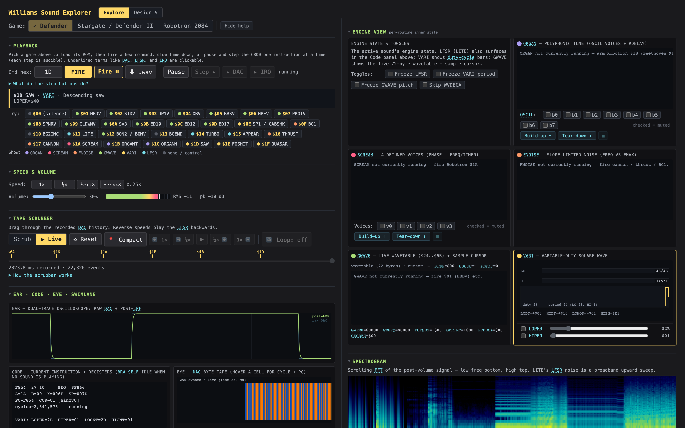

The page splits into two columns at desktop widths. **Drag the vertical divider** between them to set your preferred ratio (double-click resets to 50/50; arrow keys nudge when the divider has focus).

The left column is *sticky* while the right column scrolls with the window, so you can line up any left panel beside any right panel — here the **Ear oscilloscope** (left) reads side by side with the active **GWAVE wavetable pane** (right):

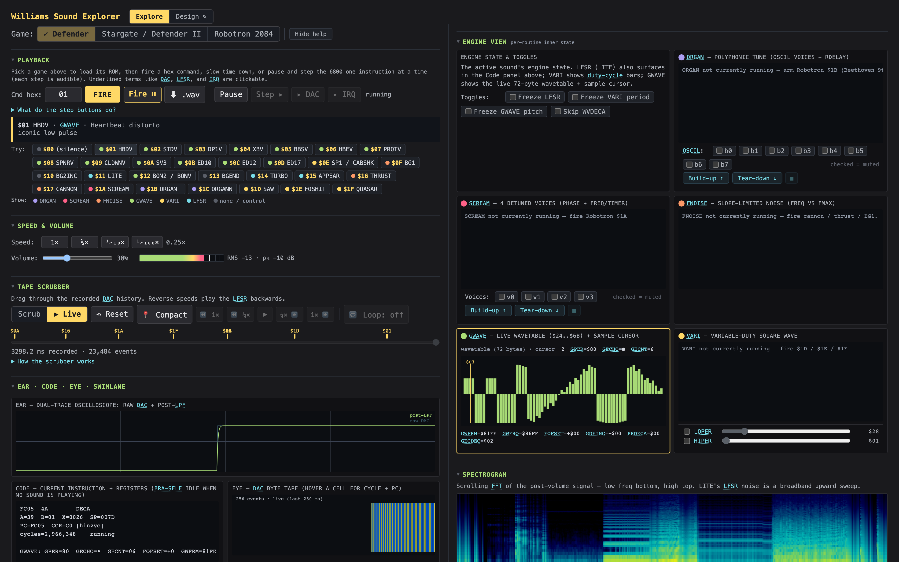

<details>
<summary>The whole UI at once (full-page map)</summary>

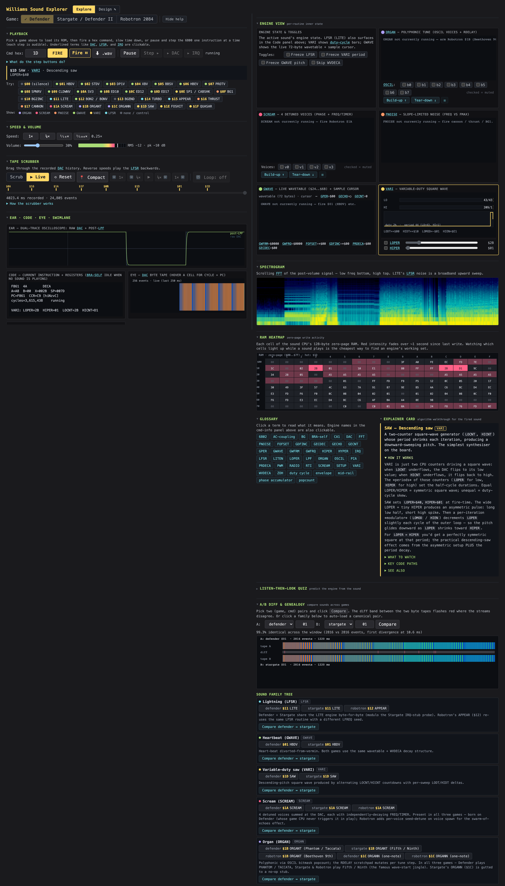

</details>

A **"Hide help"** button sits in the header (next to the game switcher).  Toggle it to remove all help text, term-link underlines, the cmdInfo blurb, and the Glossary section — the page collapses to *just data* so you can predict what's happening before the labels nudge you (Pattern 12).  Preference persists across reloads.

### Left column — controls + live grid

| Section | What it is |
|---|---|
| **Game switcher** | Three buttons — Defender / Stargate / Robotron. Click to switch (active game is yellow + checkmarked). The worklet auto-disposes and re-initialises in one operation. A game with no ROM yet shows a 🔒 and opens the upload screen when clicked; cross-game features (A/B diff, SCREAM/ORGAN sequencers) stay disabled until the ROM they need is loaded. |
| **Playback** | Fire / Fire⏸ / Pause / Step controls, a **⬇ .wav** button that renders the current command offline and downloads it (clean ROM sound, 48 kHz mono — works even before you Init), and the **Try:** chip list — one chip per command the active game responds to. Click a chip to fire the sound immediately. Each chip's leading dot is coloured by synthesis engine. The **Show:** row under the chips is both a legend and a filter — ordered to match the Engine view grid: violet = ORGAN, red = SCREAM, orange = FNOISE, green = GWAVE, yellow = VARI, cyan = LFSR, grey = none / control — and each swatch is a toggle: click one to hide that engine's sounds from the list (all on by default; click again to bring them back). |
| **Speed & volume** | Speed presets (1×, ¼×, ¹⁄₁₀×, ¹⁄₁₀₀×) + volume slider + dB meter. Slow-motion is the explorer's signature — at ¹⁄₁₀₀× LITE's LFSR clock train becomes individual audible clicks. |
| **Tape scrubber** | Always-on recording of every DAC write. A **Scrub / Live** segmented toggle (styled like the game switcher) enters scrub mode or returns to live; scrub the slider to replay any cycle range forward, reverse, or frozen. While scrubbing, the Playback transport (Fire / Pause / Step) and the Try chips grey out — the live CPU is frozen — and re-enable on **Live**. See [Tutorial 4](#tutorial-4--rewind-time-with-the-tape-scrubber). |
| **Ear · Code · Eye · Swimlane** | A **live grid** (Pattern 1, plus the swimlane). **Ear** = dual-trace oscilloscope (raw DAC + post-LPF), spanning the **full width** on top. Below it, **Code** (current 6800 instruction + registers + engine state), **Eye** (DAC byte tape — every speaker pulse, colour-coded; hover for cycle + PC), and **Swimlane** (one lane per ROM routine, showing which routine wrote each DAC sample — backed by `tools/build_labelmap.py` parsing the vasm listings) each have a 300px minimum and flow into as many columns as fit (Code + Eye sit side-by-side at the usual width, Swimlane wrapping below; everything stacks when the column is narrow). All four update from the same snapshot stream so pausing + scrubbing keeps them in lockstep. |
| **Log** | Every fire / game-switch / error in time order. Collapsed by default; sits at the bottom of the left column. |

### Right column — observation surfaces

| Section | What it is |
|---|---|
| **Engine view** | A grid of per-engine visualisers (all shown at once), each titled with its engine-colour dot (same palette as the Try list), ordered ORGAN OSCIL LEDs + RDELAY heatmap, SCREAM voice phase wheels, FNOISE frequency ramp, GWAVE wavetable, VARI duty bars. The active engine's pane is highlighted yellow. The first grid cell holds the intro + a **Toggles** row of Pattern 3 freeze controls. The VARI pane has **parameter sliders** (Pattern 5) — see [Tutorial 7](#tutorial-7--whatif-drag-a-parameter-slider). **SCREAM and ORGAN panes have voice-mute checkboxes + Build-up ↑ / Tear-down ↓ buttons** (Pattern 4) that fire the sound and flip mutes on a 700 ms timer so each voice's contribution is audible in isolation (they run on whichever game is loaded — SCREAM and ORGAN exist in all three). **Hover any toggle, voice checkbox, or row label for a tooltip explaining exactly what it does.** |
| **Spectrogram** | Scrolling FFT of the post-volume signal, full width. Low frequencies at the bottom, high at the top. LITE's broadband noise shows as a thick upward sweep. |
| **RAM heatmap** | Step 6.6, sits just below the spectrogram (open by default). 16×8 grid of the sound CPU's zero-page RAM. Cells colour cold→hot over a 1 s decay since the last write; hover a cell for `$AA = $VV · last write N ms ago` **plus what the cell does** — its name + description (e.g. `GECHO (gwave) — Echo flag`). Most cells are reused by several engines (the 128-byte zero page is overlaid), so the tooltip names the meaning for whichever engine is currently playing and notes "reused by N" when the cell is shared. Watching it during a sound is the cheapest way to find an engine's working set. |
| **Glossary** | Click any engine name, term, or DAC reference to read its full explanation — or just hover it for a one-line tooltip (41 terms across hardware, technique, engine-state, and analysis). Sits in a two-up beside the Explainer card, just below the RAM heatmap. |
| **Explainer card** | Pattern 9 (Step 6.3). Algorithm walkthrough for the most-recently-fired sound — TL;DR / how it works / what to watch / key code paths / cross-refs. Open by default, paired beside the Glossary. All 63 catalogued routines have cards (source of truth: `docs/explainer_cards.md`). |
| **Listen-then-look quiz** | Pattern 10 (Step 6.4). Random sound from the catalogue, MCQ engine identification, reveal with link into the explainer card. Tracks score per session. Collapsed by default. |
| **A/B diff & genealogy** | Pick two `(game, cmd)` pairs and click Compare. The red band between the two byte tapes flashes where they disagree. Sound family chips below auto-load canonical comparisons. |

### Keyboard shortcuts

Global shortcuts (ignored while you're typing in the hex box or a dropdown — press <kbd>?</kbd> any time for this list as an on-screen overlay). You don't have to memorise them: **every button with a shortcut shows its key in the hover tooltip** (e.g. *Fire … [Space]*), so you can discover the binding right where you'd click. **These bindings are Explore-only** — switch to Design and a smaller, Design-specific keymap takes over (see [`MANUAL_DESIGNER.md`](MANUAL_DESIGNER.md) §*Keyboard shortcuts*), so <kbd>Space</kbd> won't fire an Explore command while you're authoring.

| Key | Action |
|---|---|
| <kbd>Space</kbd> | Fire the current command (replay) |
| <kbd>P</kbd> | Pause / Resume |
| <kbd>←</kbd> <kbd>→</kbd> | Nudge time — seek while scrubbing, single-step one instruction when paused |
| <kbd>↑</kbd> <kbd>↓</kbd> | Volume up / down |
| <kbd>1</kbd>–<kbd>4</kbd> | Speed: 1× · ¼× · ¹⁄₁₀× · ¹⁄₁₀₀× |
| <kbd>D</kbd> / <kbd>I</kbd> | Step to next DAC write / next IRQ |
| <kbd>S</kbd> | Toggle Scrub / Live |
| <kbd>L</kbd> / <kbd>R</kbd> | Scrub loop mode / Reset |
| <kbd>G</kbd> | Cycle game (Defender → Stargate → Robotron) |
| <kbd>/</kbd> | Focus the command box |
| <kbd>H</kbd> | Toggle help text |
| <kbd>?</kbd> | Show the shortcuts overlay |

Context-specific (when an element has focus):

- **Cmd hex input**: type a 2-character hex code (e.g. `1D`), then <kbd>Enter</kbd> (or click Fire) to fire it.
- **Splitter handle**: ←/→ nudge 2%, Shift+←/→ nudge 5%, Home/End jump to extremes, Space/Enter = 50/50.

### Designer mode (a separate mode)

The **Explore | Design ✎** switch in the header flips between this read-only explorer and a separate **Sound Designer** mode, for building your own custom sound ROM. It forks the game's sound bank and lets you edit any of its **five data-driven engines** (VARI, GWAVE, LFSR, FNOISE, RADIO — per-engine parity with the Defender Sound Studio, but across all three games), audition + A/B, and export a JSON recipe or a runnable `.bin` for MAME / a real cabinet. Switching to Design doesn't change anything in Explore. It has its own manual: **[`MANUAL_DESIGNER.md`](MANUAL_DESIGNER.md)**.

---

## 3. The six synthesis engines

Every Williams sound is built from one of these algorithms. Read [`docs/synthesis_techniques.md`](docs/synthesis_techniques.md) for the source-level walk-through.

| Engine | Used for | What it does |
|---|---|---|
| **LFSR** | LITE (lightning), APPEAR, TURBO, NOISE | A 16-bit linear-feedback shift register clocked at audio rate. Each bit-out toggles the DAC. Output = pseudo-random noise. Pitch comes from LFREQ (how often we tick) and CYCNT (outer envelope). |
| **VARI** | SAW (descending pitch), CABSHK, MOSQTO | Variable duty-cycle square wave. Two countdowns alternate: LOCNT for the low half, HICNT for the high. Per-sweep LODT/HIDT deltas slope the pitch, LOMOD nudges the base period. The duty cycle is the LOPER:HIPER ratio. |
| **GWAVE** | HBDV (heartbeat), BG1/BG2, most melodic sounds | General-purpose wavetable. A 72-byte sample table at `$24..$6B` is read sequentially through the X register. WVDECA mutates the table in place for echo decay. GPER controls per-sample dwell (= pitch). |
| **FNOISE** | CANNON, THRUST, BG1 (Defender) | Filtered noise. A 16-bit FHI:FLO accumulator slopes up to FMAX then back down; DSFLG enables random-distortion modulation. SAMPC counts samples until the sound ends. |
| **SCREAM** | SCREAM `$1A` (all three games — born on Defender; Robotron adds voice-spawn detune) | Four detuned oscillators summed at the DAC. Each voice has a `{freq, timer}` pair; voices decay at different rates → they drift out of sync → the iconic "scream" emerges. |
| **ORGAN** | ORGANT `$1B` tunes + ORGANN `$1C` notes (all three games — Defender plays PHANTOM / TACCATA, Stargate & Robotron play Fifth / Ninth) | Polyphonic via OSCIL bitmask popcount (up to 8 voices from one byte). Plays through a 60-byte RDELAY scratchpad that's re-loaded per note. |

The engine pane in the right column visualises whichever one is currently running. The Code panel also surfaces the engine's state textually as an `LFSR: …` / `VARI: …` / etc. line.

Each engine's live pane, captured on Defender (fire the command in parentheses to reproduce):

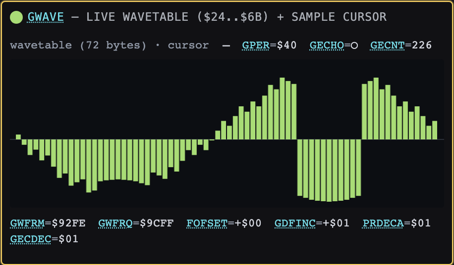
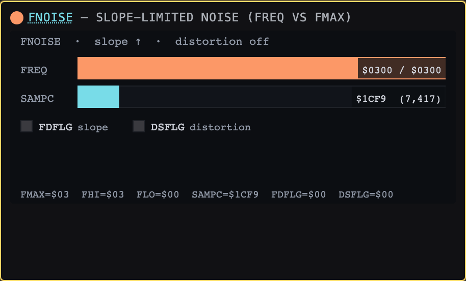
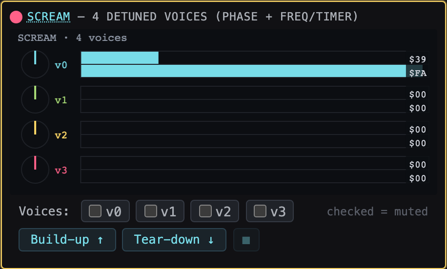
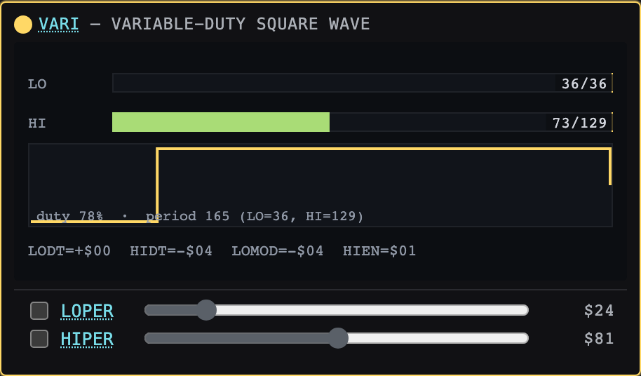
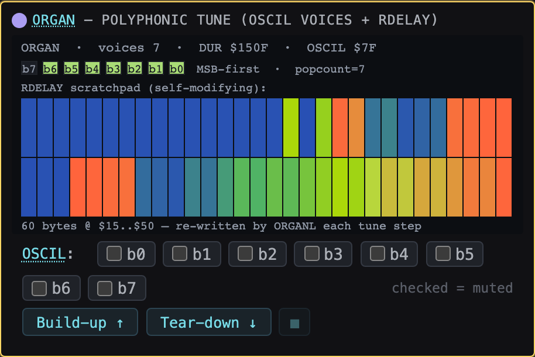

---

## 4. Tutorials

Each tutorial has a goal, exact clicks, and what you should hear / see. Linked context references go deeper.

### Tutorial 1 — Hear your first sound

**Goal**: confirm the explorer is alive and you understand the basic Fire → see-what-happens loop.

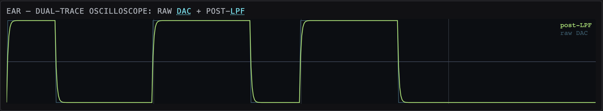

1. Open http://localhost:5173 with the dev server running. Defender is already selected.
2. In the **Playback** section, find the chip labelled `$11 LITE` (cyan dot — LFSR engine).
3. Click it once.

What you should hear: a ~700 ms crackling lightning sound. This is the same sound Defender (1980) plays when you fire a spread-shot.

What you should see:
- **Ear**: a noisy waveform briefly fills the oscilloscope.
- **Eye** (DAC byte tape): coloured cells fill from the right edge as bytes are written.
- **Code**: registers update; you'll see the disassembly pointing at instructions like `STAA $0400` (writing the DAC) and `EORA $0A` (the LFSR feedback step).
- **Stage swimlane**: yellow band appears for the `LITE` routine, then `LITEN`, then back to the IRQ tail and `BRA *` (idle).
- **Spectrogram**: a thick broadband sweep moving upward — the LFSR clock accelerating.
- **Engine view → VARI/GWAVE/etc**. all stay idle; LFSR doesn't have its own canvas pane (its state shows in the Code panel as `LFSR: state=… bit=… LFREQ=… CYCNT=…`).

**Context**: LITE is the *smallest* sound in any Williams ROM — about 30 instructions. It's the canonical "does the whole explorer work end-to-end" test. The full algorithm is documented in [`docs/synthesis_techniques.md` §LFSR](docs/synthesis_techniques.md) and the source lives in `research/williams-soundroms/VSNDRM1.SRC:265-289` (search for `LITEN`).

---

### Tutorial 2 — Slow down LITE: watch the LFSR shift

**Goal**: see the linear-feedback shift register actually shifting, one bit at a time.

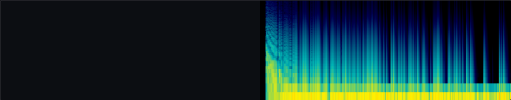

1. Fire `$11 LITE`.
2. While it's playing, in **Speed & volume**, click `¹⁄₁₀×`. The sound becomes a low buzz.
3. Click `¹⁄₁₀₀×`. Now you can hear *individual clicks* — each click is one toggle of the DAC, one bit of LFSR feedback.
4. Watch the **Code** panel's LFSR line. As clicks fire, you'll see `state=` and `bit=` change with each one.
5. Watch the **Spectrogram**. Vertical lines now appear; each line is one DAC transition.

What you're hearing: the LFSR's clock rate slowed by 100×. At normal speed the LFSR cycles ~10 kHz worth of bits per second — far above the audible limit, so it sounds like noise. At ¹⁄₁₀₀× the bits are spaced at ~100 Hz — well within the audible band, where each shift is a click.

**Context**: Slow-motion is the central pedagogical idea of the explorer. From [`docs/pedagogical_design.md`](docs/pedagogical_design.md): "every variable that affects what you hear should be visible, named, and animatable at human-scale (1×, ¹⁄₁₀×, ¹⁄₁₀₀×, single-step)." The point is to stop the sound from being a black box.

The LFSR algorithm is unusually elegant — 30 lines of 6800 assembly produce something acoustically indistinguishable from white noise. See `research/williams-soundroms/VSNDRM1.SRC:268-289` for the original code; the feedback polynomial is `bit[0] ^ bit[3] ^ bit[4]` (encoded via the `EORA LO; LSRA; ROR HI; ROR LO` sequence).

---

### Tutorial 3 — The byte tape: every speaker pulse, individually

**Goal**: see every single DAC write as a coloured cell, in time order.

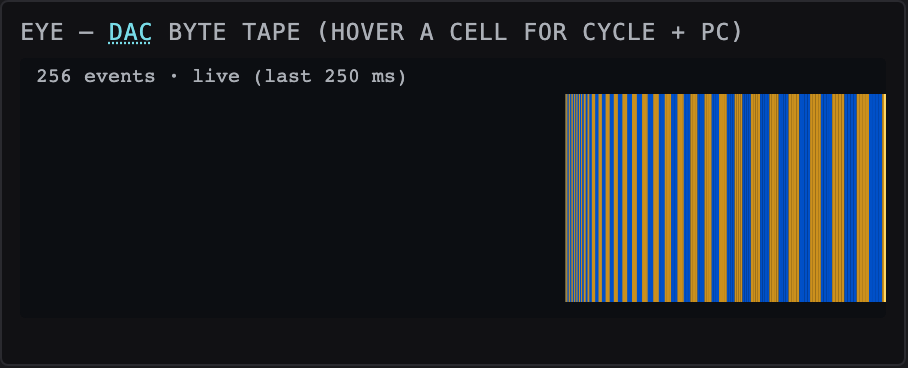

1. Click `¹⁄₁₀×` to slow down a bit (makes the tape easier to read).
2. Fire `$01 HBDV` (Defender heartbeat) — green dot, GWAVE engine.
3. Look at **Eye** (in the live grid, below the Ear oscilloscope). As the heartbeat plays, the tape scrolls right-to-left. Each rectangle is one byte the CPU wrote to address `$0400` (the DAC).
4. Hover any cell. The tooltip shows:
   - The hex byte value (`$XX`) and its normalised float
   - The CPU cycle when it was written
   - The PC of the writing instruction
   - The source-line citation: e.g. `from PC $FC23  GPRLP  VSNDRM1.SRC:826`

The colour scheme is symmetric around the mid-rail (`$80`):
- Cool blue → negative values
- Green → near silence
- Yellow / red → positive values

**Context**: The byte tape is *Pattern 2* from [`docs/pedagogical_design.md`](docs/pedagogical_design.md). It's the most literal visualisation possible — there's nothing between you and the speaker except this stream of bytes. Reading the tape teaches you how each engine encodes audio:

- LITE's tape alternates blue/red in a noisy pattern (the LFSR).
- HBDV's tape shows a sine-shaped wave repeating, then the colours dim across echoes (WVDECA decay).
- SAW's tape shows blocks of one colour, then the other (the duty cycle).

The source-line citation comes from the **label map**: `tools/build_labelmap.py` parses the assembled vasm listings into a JSON table mapping every ROM address back to its source label + line number. See [`docs/explorer_implementation.md` §Stage swimlane + label map](docs/explorer_implementation.md) for how that pipeline works.

---

### Tutorial 4 — Rewind time with the tape scrubber

**Goal**: replay any past instant of audio + visualisation, forward or reverse.

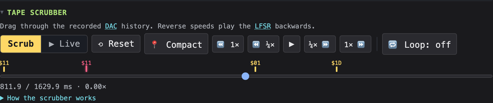

1. Fire `$1D SAW` (yellow dot, VARI engine).
2. After it finishes (~1.9 s), look at the **Tape scrubber** section. You'll see yellow markers on the slider — one per sound you've fired.
3. Click the rightmost yellow marker labelled `1D`. The slider jumps to the start of that segment and pauses.
4. Click `⏩ ¼×` (forward, quarter speed). SAW replays in slow motion — you can hear the descending pitch, see the VARI countdown bars step, watch the byte tape scroll forward.
5. Click `⏸` to freeze, drag the slider manually, hear individual DAC bytes as you scrub.
6. Click `⏪ ¼×` to play **in reverse**.

What you're hearing: SAW played backwards. The descending pitch becomes ascending. The VARI countdown bars also tick in reverse — including the **GWAVE wavetable bytes** (if you fire `$01 HBDV` first and scrub back through it, the WVDECA decay un-happens).

**Context**: Tape-loop scrubbing is *Pattern 11*. Implementation: every DAC write the CPU makes during live playback is captured into a `DacHistory` ring buffer with its cycle stamp. Scrub mode replays the buffer at any speed (negative = reverse) without re-running the CPU.

The really clever bit landed in the most recent commits: a parallel **RAM history ring** captures zero-page RAM + the X register every 512 cycles. So when you scrub the slider, the engine view's bars / wavetable / countdowns *animate* — not just the audio. Read [`docs/explorer_implementation.md`](docs/explorer_implementation.md) §"Known caveats" → the entry on "Scrub mode time-travels engine-slot values" describes this.

---

### Tutorial 5 — The Stage Swimlane: which routine made this sound?

**Goal**: see the dispatch path through the ROM as a sound plays.

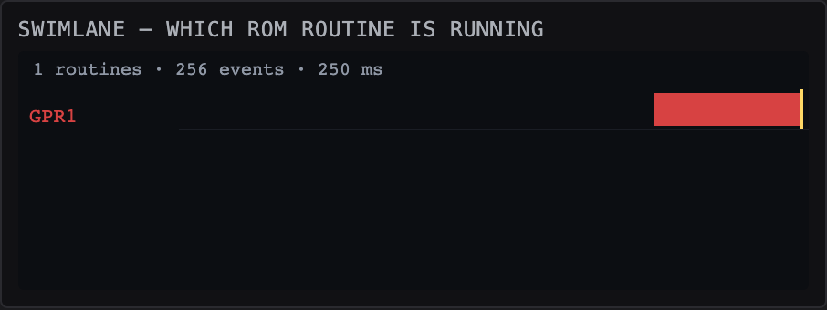

1. Fire `$01 HBDV` and let it complete.
2. Scrub back to the start of the segment (yellow marker).
3. Now look at the **Swimlane** panel (in the live grid, below the Ear oscilloscope). You'll see horizontal lanes labelled with ROM routine names: probably `GWLD`, `GWAVE`, `GPLAY`, `WVDECA`, `IRQ`, `BRA *`.
4. Each band shows when that routine was writing to the DAC. Their order top-to-bottom = order of first appearance in the window.
5. Click `⏩ 1×` and watch the bands light up sequentially as the sound plays. The dispatch path is visible: SETUP → IRQ entry → GWLD (load wavetable from ROM) → GPLAY (play it through the X cursor) → WVDECA (decay one step) → back to GPLAY (next echo) → back to IRQ tail.

**Context**: This is *Pattern 1* + *Pattern 8* combined — the swimlane shows the *which* of the code being executed; hovering the spectrogram (or byte tape) above publishes an "INSPECT" cursor to the Code panel showing the exact source line that produced the sample under your mouse.

The lane labels come from the same label-map JSON that powers the byte tape's tooltip. Both are sourced from `tools/build/VSNDRM1.lst` (the vasm listing) → `tools/build_labelmap.py` → `explorer/public/data/defender_labelmap.json`.

---

### Tutorial 6 — Freeze the LFSR: what's noise without the shift?

**Goal**: hear what LITE's LFSR contributes to the sound by removing it.

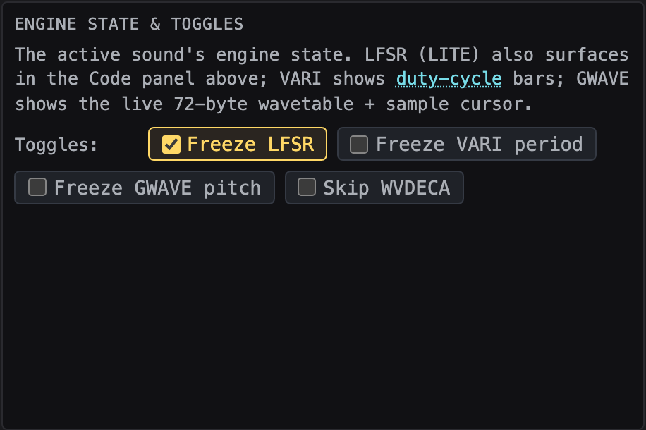

1. Fire `$11 LITE` to confirm what it normally sounds like.
2. In the **Engine view** section's **Toggles** row at the top, check **Freeze LFSR**.
3. Fire `$11 LITE` again.

What you should hear: **a steady periodic click train**, not noise. The pitch is roughly the LFREQ counter rate.

What's happening: LITE's inner loop reads `LO`, shifts/EORs it, writes back `HI` and `LO`. With `Freeze LFSR` on, every CPU write to `$09` or `$0A` is silently dropped (`SoundBoard.shouldDiscardWrite()`). So `LO` and `HI` never change — the LFSR is stuck at whatever value it had when LITEN entered. Each iteration reads the *same* `LO`, computes the *same* carry-out, fires the *same* DAC pulse. Result: a single fixed pattern repeating at LFREQ rate.

This *proves* that the shift is what makes LITE sound like noise. Take it away and you get a square-ish tone.

**Context**: Pattern 3 (solo / mute / freeze) from [`docs/pedagogical_design.md`](docs/pedagogical_design.md). The implementation is in `explorer/src/engine/engineToggles.ts` — a tiny predicate that gates specific zero-page addresses per engine.

Try the other toggles too:
- **Freeze VARI period** + fire `$1D SAW` → no descending pitch, steady square wave with the fire-time duty cycle.
- **Freeze GWAVE pitch** + fire `$01 HBDV` → heartbeat plays at a fixed pitch (no tune contour).
- **Skip WVDECA** + fire `$01 HBDV` → echoes don't decay; the wavetable stays at full amplitude across every repeat.

---

### Tutorial 7 — What-if: drag a parameter slider

**Goal**: change a synthesis parameter in real time and hear the algorithm respond.

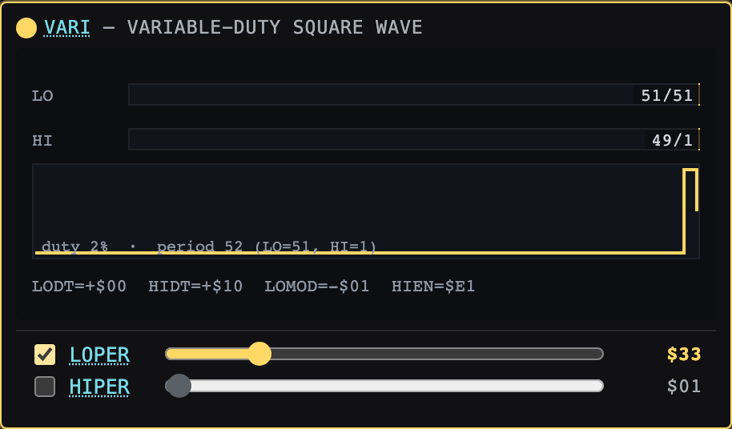

1. Click `$1D SAW` to start the descending saw sound.
2. While SAW is still playing, find the **VARI engine pane** (top-left of the Engine grid). Below the canvas are two slider rows:
   ```
   [ ] LOPER  ──●─────  $40
   [ ] HIPER  ────●───  $A0
   ```
   The values are *live*: as the CPU runs VARI, LOPER and HIPER decay through their sweep, and the slider positions track them.

3. With SAW still playing, **check the "Force" checkbox** on the LOPER row.
   - The row turns **yellow** — visual cue that the override is now active.
   - The slider stops auto-tracking. Whatever value LOPER had at that instant is now *pinned* in RAM cell `$13` regardless of what the CPU writes.

4. Drag the LOPER slider. The duty cycle of the sound changes audibly:
   - Drag to `$10` → tight, buzzy
   - Drag to `$80` → roughly symmetric square
   - Drag to `$F0` → low rumble

5. Try `HIPER` too. Set LOPER = `$20`, HIPER = `$80` → clearly asymmetric "reed" square wave.

6. **Uncheck Force** to release the override. The slider snaps back to live tracking; the CPU resumes its sweep.

**What's happening under the hood**: every CPU instruction writing to `$13` (`STAA $13` is the canonical one inside `VSWEEP`) is intercepted by `SoundBoard.write()`, the supplied byte is discarded, and the slider's value is written instead. The CPU sees no error — its next `LDAA $13` returns your value. The synthesis algorithm runs unchanged; it just operates on the byte you chose.

**Context**: This is *Pattern 5* — "what-if parameter sliders" — implemented as the `paramOverrides` map on the SoundBoard. See [`docs/pedagogical_design.md`](docs/pedagogical_design.md) §Pattern 5 for the original design.

The architecture matters: we *don't* recompile or modify the ROM. The ROM runs exactly as Sam Dicker wrote it in 1980. We just substitute one zero-page byte at the bus level. This is the same trick the [Defender Sound Studio](docs/sound_studio_reference.md) uses, but here it's live and reversible.

---

### Tutorial 8 — Cross-game A/B: Defender HBDV vs Stargate HBDV

**Goal**: see whether two games share the same sound implementation.

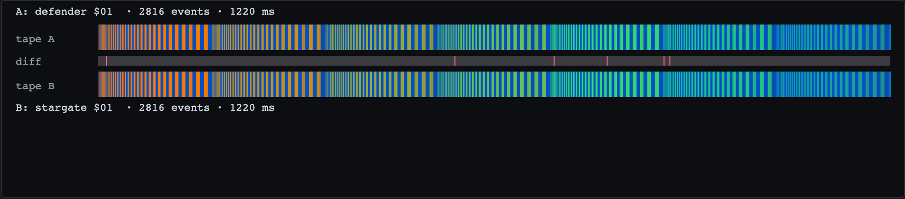

1. Open the **A/B diff & genealogy** section (collapsed by default — click the heading).
2. Set the A picker to `defender 01`, B picker to `stargate 01`.
3. Click **Compare**.
4. Two byte tapes appear with a red divergence band between them. The summary line shows `% identical`.

What you should see: ~95 %+ identical. There's a small offset because Stargate's IRQ handler probes for a hypothetical "talking" ROM that doesn't exist; the probe takes 10 cycles. After that the bytes match exactly.

**Context**: Stargate (Defender II) was a fast-turnaround sequel — Williams reused the Defender sound ROM almost verbatim and added a few new commands. Verifying this at the byte level is one of the explorer's selling points. See [`research/findings_stargate_sound.md`](research/findings_stargate_sound.md) for the source-level diff details.

Now try Defender `01` vs Robotron `01`. The diff band lights up red almost everywhere — Robotron rewrote the GWAVE engine substantially (new wavetables, different RAM layout). The same *engine concept* (a wavetable + decay) but a different implementation.

---

### Tutorial 9 — Genealogy: one engine, three games

**Goal**: see which sounds across the three games share an algorithm.

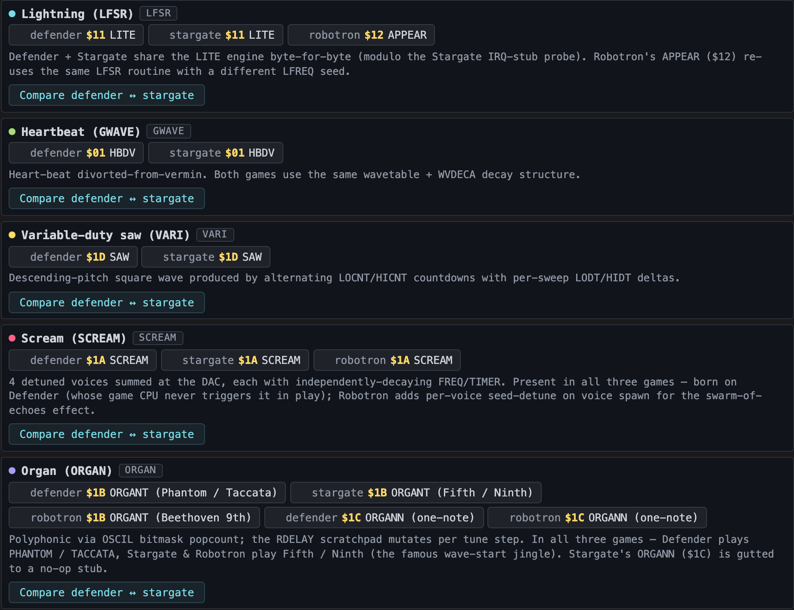

1. In the **A/B diff & genealogy** section, scroll past the diff canvas to **Sound family tree**.
2. You'll see five families: Lightning (LFSR), Heartbeat (GWAVE), Variable-duty saw (VARI), Scream (SCREAM), Organ (ORGAN) — the last two appear in all three games (SCREAM was born on Defender), so they're cross-game comparable too.
3. Click the **Compare ↔** button on the Lightning family. The A/B diff above auto-loads `defender $11` vs `stargate $11` and fires.
4. Click each individual member chip to load it into slot A then slot B (a small `A` or `B` badge appears on the chip showing which slot it's in).

**Context**: The genealogy data is hand-curated — see `explorer/public/data/genealogy.json`. Adding a new family is a JSON edit. The intent is to surface the *evolution* of the engines across the three games: which sounds are direct ports, which are re-implementations, which are new.

For deeper genealogy reading: [`docs/sound_studio_reference.md`](docs/sound_studio_reference.md) has Mike Hutchinson's analysis of the cross-Williams engine lineage.

---

### Tutorial 10 — Step through a sound instruction by instruction

**Goal**: see exactly what the 6800 CPU does, one instruction at a time, with audible feedback per step.

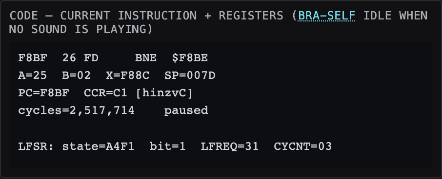

1. Click `$11 LITE` to fire and **immediately click `Pause`**. Or use the `Fire ⏸` button which combines both — fires the command and pauses.
2. Look at the **Code** panel. You'll see the disassembled instruction at the current PC.
3. Click `Step ▸`. One instruction executes. The PC advances. You may hear a single click (the step's audio is queued back through the LPF).
4. Click `▸ DAC`. The CPU runs until the next `STAA $0400` — i.e. one DAC write, one sample of sound. You hear that one sample.
5. Click `▸ IRQ`. The CPU runs until the next IRQ vector — one "tick" of the sound engine.

**Context**: The 6800 emulator runs cycle-accurately. Every Williams instruction is implemented; `tools/render_sound.ts` can produce a bit-for-bit identical WAV from the ROM. So when you single-step you're seeing the *actual* CPU state the hardware would have at that instruction — same registers, same flags, same memory.

The Code panel shows:
- Disassembly of the current PC
- A, B, X, SP registers
- CCR flag bits (H I N Z V C)
- Cycle count + running/paused/scrubbing status
- An engine-state line when the current PC is inside an engine block (e.g. `LFSR: state=ABCD bit=1 LFREQ=$05 CYCNT=$03`)

For the 6800 instruction set and addressing modes the explorer implements, see `explorer/src/cpu/instructions.ts` (~160 opcodes) and the disassembler in `explorer/src/cpu/disasm.ts`.

---

### Tutorial 11 — Causal hover: hover a spike, find its source line

**Goal**: trace any audible feature back to the exact line of 6800 code that produced it.

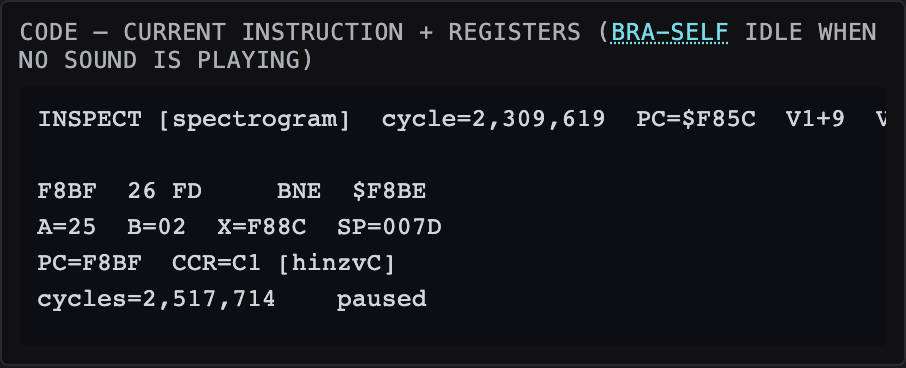

1. Fire `$11 LITE` and wait for it to play out.
2. **Hover the Spectrogram** with your mouse. As you move horizontally, the Code panel grows a top line:
   ```
   INSPECT [spectrogram]  cycle=12,345  PC=$F8A7  LITE0  VSNDRM1.SRC:269
   ```
3. Scrub the cursor over a specific spectrogram feature — say, the very first broadband sweep. The INSPECT line resolves the cycle → PC → source line in real time.

What's happening: the Spectrogram tracks the CPU cycle for each column it paints. On hover, mouse-X → ring index → cycle. Then a client-side cache (built up from the DAC history) resolves cycle → PC, and the label map resolves PC → routine + source line.

You can do the same hover on the **byte tape** (Eye panel) — that gives you the cell's exact write, and the INSPECT line shows the producing instruction. (The byte tape's hover already shows this in its tooltip; the INSPECT line on the Code panel is the cross-panel echo.)

**Context**: This is *Pattern 8* — causal hover trace. The idea is that you should never have to ask "where did that sound come from?" because every audible event is reachable from a mouse hover.

---

### Tutorial 12 — Combine toggles + sliders + scrub for "what would Robotron's HBDV sound like with WVDECA disabled?"

**Goal**: a chain of features.

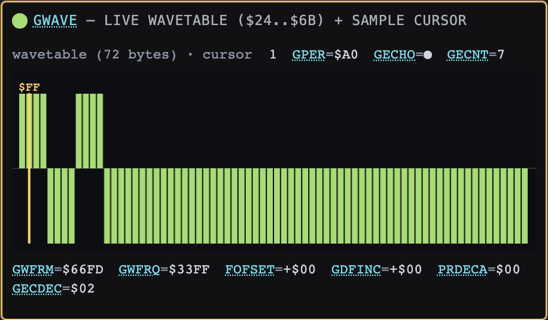

1. Switch the game to **Robotron**.
2. In the Engine view → Toggles row, check **Skip WVDECA**.
3. Fire `$01 HBDV` (Robotron's heartbeat — uses the same GWAVE engine as Defender).
4. The heartbeat repeats at full amplitude across many echoes (normally each echo decays).
5. Scrub through the recording — the **Wavetable** pane stays at the same heights across the entire sound (because WVDECA never ran).
6. Uncheck the toggle and re-fire. Now the echoes decay normally.

**Context**: WVDECA is the SBA-based per-byte subtraction loop in the GWAVE engine. Its source lives in `VSNDRM1.SRC:879-907` (`WVDECA  TSTA  /  BEQ WVDCX  ...`). Each pass through the GWTAB cells reduces each byte by `1/16` of its index value — a multiplicative decay that produces the characteristic exponential-amplitude envelope.

Skipping WVDECA gives you a "perfect" heartbeat that never decays — useful for hearing what the wavetable *itself* sounds like, isolated from the envelope shaper.

---

## 5. Reference

### Common pitfalls

- **First click on Fire makes no sound** → Was an autoplay-policy quirk in some browsers; should be fixed (every worklet message now opportunistically resumes the AudioContext). If you see it, file a bug.
- **Engine pane labelled `LFSR` is empty** → That's by design. LFSR has no canvas pane; its state surfaces as a textual line in the Code panel.
- **Scrubber slider blank** → No sound fired yet; the DAC history is empty.
- **Wavetable bars frozen during scrub** → Should now animate (RAM time-travel). If they stay frozen, you're probably scrubbing further back than the 10 000-snapshot ring covers (~5–10 s).
- **Robotron commands above `$1B` do nothing** → Most of those are reserved or set flags rather than playing audible sounds.
- **`$1C` ORGANN is silent** → On Stargate and Robotron the routine is gutted to a single `RTS` (Stargate by design, Robotron as a placeholder). On Defender it's a true *four-byte* protocol — `$1C` arms a counter, and the next three IRQs are interpreted as osc / dly / note#. **Defender's `$1C` now has a picker**: the cmdInfo panel (type `1C` in the Cmd hex input, switch to Defender) shows three small hex inputs + an "Arm + Play" button that fires the full 4-byte sequence for you.
- **`$1B` ORGANT auto-pulses to play tune 1** → Firing `$1B` alone arms `ORGFLG` but doesn't play anything (see [Why `$1B` is special](#why-1b-organt-is-special) below).  The explorer auto-fires a follow-up tune index (`$01` = PHANTOM on Defender, FIFTH on Stargate / Robotron) 40 ms after every `$1B` click so a single click plays a tune.  Use the picker dropdown in the cmdInfo panel to pick a different tune (e.g. NINTH on Robotron = Beethoven's 9th).
- **Engine view shows previous sound's state briefly** → After a sound ends, the engine view holds its last frame to avoid flicker between in-range and out-of-range PC samples.  On the next fire it clears to the idle caption first, then re-paints for the new sound.  Intentional — see `viz/ExplainerCard.ts` and `viz/ORGANView.ts` for the rationale.
- **Explainer card section is empty before first fire** → That's the initial state.  Fire any sound and the card for that routine loads automatically.  Cards exist for all 63 catalogued routines.

### Why `$1B` ORGANT is special

Click `$1B` and you'd expect to hear a tune — and you now do, because the explorer auto-pulses for you. But the ROM behaviour itself is unusual and worth understanding, because the same "arm-only" trick is used elsewhere:

```text
ORGANT    DEC  ORGFLG    ; minus the organ flag
          RTS             ; ...and that's the whole routine
```

That's literally it. No DAC writes, no tune playback. So how does Beethoven actually get out of the speaker? Look at the IRQ entry path (Robotron `VSNDRM3.SRC:1716`):

```text
IRQ:
    ...
    LDAB ORGFLG
    BEQ  IRQ00           ; flag clear → skip the tune
    JSR  ORGNT1          ; flag set   → play the armed tune NOW
IRQ00:
    ... decode the new command and dispatch ...
```

The actual tune playback (`ORGNT1` → `ORGASM` → walks `ORGTAB`) is checked at the **start of every IRQ, *before* the command dispatch**. So the canonical sequence is:

1. Game CPU writes `$1B` → IRQ enters with `ORGFLG = 0` → tune skipped → dispatches to `ORGANT` → `ORGFLG = -1` → IRQ exits to `BEQ *` (spin).
2. Game CPU writes any byte `N` → next IRQ enters with `ORGFLG = -1` → `JSR ORGNT1` with A=`N` → tune `N` plays start-to-end.

In the real arcade, the main CPU constantly pulses the sound CPU (every tick of game logic), so the "next IRQ" arrives within milliseconds. In the explorer, a single human click of `$1B` would just arm the flag and leave the CPU spinning — no second pulse, no tune. **The explorer auto-pulses a follow-up `$01` 40 ms after every `$1B` click**, so the default is "Fire `$1B` → hear tune 1". The arm-form picker that appears below the `Cmd hex:` field lets you pick a different tune number.

This same "set a flag, RTS, play it next IRQ" idiom is used elsewhere in the ROMs (background tracks, distortion sounds), but for those the kicker arrives via the IRQ-3 background loop without needing a follow-up command. `$1B` is the only one where a standalone single-click would otherwise hang the CPU on `BEQ *`.

**Inventory of arm-only commands across all three games (audit complete — these are the only ones)**:

| Game | Cmd | Routine | Behaviour |
|------|-----|---------|---|
| All 3 | `$1B` | ORGANT | Arms tune flag (auto-pulsed by the explorer → plays tune 1 by default; picker selects tune #) |
| Defender | `$1C` | ORGANN | Arms a 3-byte data sequence (osc-hi / osc-lo / note); no auto-pulse, fire 4 bytes manually |
| Stargate | `$1C` | ORGANN | Gutted to `RTS` — silent by design |
| Robotron | `$1C` | ORGANN | `RTS` placeholder — silent by design |

### File-system layout

```
williams-sound-explorer/
├── MANUAL.md           ← this file
├── CLAUDE.md           agent-facing context pointer
├── docs/               curated reference docs
├── research/           raw findings + ROM source
├── tools/              vasm + preprocessor + CLI WAV renderer
└── explorer/           the TypeScript app (Vite + AudioWorklet)
```

### Commands you can run

```bash
tools/build_roms.sh                                       # rebuild all 3 ROMs from source
cd explorer && npm test                                    # full Vitest suite
cd explorer && npx tsc --noEmit                            # strict TypeScript check
cd explorer && npm run dev                                 # the explorer (http://localhost:5173)
cd explorer && npm run build                               # production bundle
npx tsx tools/render_sound.ts defender 0x11 out/x.wav     # render any sound to WAV
npx tsx tools/render_sound.ts robotron 0x1A out/x.wav     # SCREAM, 5 seconds
```

### Where to go deeper

- **Want to understand the original hardware** → [`docs/sound_hardware_model.md`](docs/sound_hardware_model.md)
- **Want to understand the eight DSP primitives** → [`docs/synthesis_techniques.md`](docs/synthesis_techniques.md)
- **Want to look up a specific command code** → [`docs/defender_sound_catalogue.md`](docs/defender_sound_catalogue.md) / [`docs/stargate_sound_catalogue.md`](docs/stargate_sound_catalogue.md) / [`docs/robotron_sound_catalogue.md`](docs/robotron_sound_catalogue.md)
- **Want to read the actual 1980 source code** → `research/williams-soundroms/VSNDRM1.SRC` (Defender), `VSNDRM2.SRC` (Stargate), `VSNDRM3.SRC` (Robotron). The originals are in MC6809 assembler dialect; the preprocessor in `tools/williams_preproc.py` bridges 17 dialect quirks to feed vasm.
- **Want to know what's been built (TypeScript implementation)** → [`docs/explorer_implementation.md`](docs/explorer_implementation.md)
- **Want to know the design philosophy** → [`docs/pedagogical_design.md`](docs/pedagogical_design.md) (5 design principles + 12 UX patterns)
- **Want to know the project roadmap** → [`~/.claude/plans/goal-is-to-built-purrfect-river.md`](~/.claude/plans/goal-is-to-built-purrfect-river.md)
- **Want prior art / inspiration** → [`docs/sound_studio_reference.md`](docs/sound_studio_reference.md) describes zapspace's Defender Sound Studio

### Historical timeline

| Year | Event |
|---|---|
| **1980** | Eugene Jarvis writes Defender for Williams. Sam Dicker writes the sound ROM (`VSNDRM1.SRC`). 2 KB of 6800 assembly, 32 sound effects. First Williams arcade game with a dedicated sound board. |
| **1981** | Stargate (Defender II) ships. Sound ROM is `VSNDRM2.SRC` — about 95% identical to Defender, with a few new commands and one IRQ-stub probe (the ROM checks for a hypothetical talking-speech board that never shipped). |
| **1982** | Robotron 2084 ships. Eugene Jarvis + Larry DeMar redesign the engine library. New ROM `VSNDRM3.SRC` doubles to 4 KB, adds external RAM, introduces SCREAM (4-voice detune) and ORGAN (polyphonic via popcount). 63 sound commands. Plays Beethoven's 9th as the wave-start jingle. |
| **2024-2026** | This explorer project. Disassembles the original ROMs, re-assembles them via vasm, emulates them in a browser, makes everything visible and tweakable. |
| **2026 May** | All 12 UX patterns from `docs/pedagogical_design.md` shipped (1–12).  Phase 6 brings: voice-mute Build-up/Tear-down for SCREAM + ORGAN (Pattern 4), parameter-override sliders (Pattern 5), annotated explainer cards for every catalogued routine (Pattern 9, 63 cards), listen-then-look quiz (Pattern 10), Hide-help toggle (Pattern 12), RAM heatmap, ORGANT `$1B` auto-pulse, ORGANN `$1C` 4-byte picker (Defender), MAME ROM equivalence audit (Stargate + Robotron byte-identical; Defender within 2 hand-patched bytes), bulk audio corpus with `tools/refresh_corpus.sh`. |
| **2026 May (UI pass)** | Layout reorg to make the live view fit one screen: the Ear/Eye/Code triangle became a 2×2 **live grid** with the Stage swimlane pulled in beside the oscilloscope; spectrogram went full-width; RAM heatmap moved below it (open by default) with engine-aware cell-name tooltips; Glossary + Explainer card paired in a two-up (Explainer open); Log moved to the bottom of the left column (collapsed). Added a per-control **⬇ .wav export** (offline re-render of the current command), 15 more glossary terms (now 33), engine-pane titles, and explanatory tooltips on every Engine-view toggle / voice checkbox. |
| **2026 May (ROMs)** | The explorer stopped bundling the copyrighted ROM bytes. A first-run **onboarding screen** takes user-supplied sound ROMs (validated by size + 6802 vectors + SHA-1 allowlist, stored in IndexedDB); the app runs with as few as one ROM, and games without one are locked in the switcher. This let the project be published MIT-licensed without distributing Williams' copyrighted data. |
| **2026 May (engine-view pass)** | All five engine panes now show at once (ordered ORGAN · SCREAM · FNOISE · GWAVE · VARI, each titled with its engine-colour dot); the intro + freeze toggles ride in the first grid cell. Corrected a long-standing mislabel: **SCREAM (`$1A`) and ORGAN (`$1B`/`$1C`) are in all three games** — not Robotron-only — so their panes now animate on Defender and Stargate too, and both are cross-game comparable in the A/B diff / genealogy. GWAVE pane readouts wrap to two lines (no more truncated/overlapping text). |
| **2026 May (keyboard + internals)** | Full **keyboard control** — <kbd>Space</kbd> fires, <kbd>1</kbd>–<kbd>4</kbd> set speed, arrows nudge time / adjust volume, <kbd>G</kbd> cycles game, <kbd>?</kbd> shows the overlay (typing in the hex box is never hijacked), plus <kbd>Enter</kbd>-to-fire in the command box. Under the hood the ~1900-line UI entry was split into focused per-feature modules and the page's inline CSS moved to its own file — no behaviour change. |

The names you'll see in the ROM source — `SETUP`, `LITE`, `HBDV`, `WVDECA`, `GWAVE`, `ORGAN` — are the original labels Sam Dicker (and later Jarvis/DeMar) used in 1980-1982. The explorer's swimlane, byte tape, and Code panel surface these names directly so you can read the explorer and read the source side by side.

---

## 6. Feedback

The explorer is a learning tool, not a finished product. Things that don't make sense, sounds that don't behave as expected, UX that gets in the way — all worth flagging. The plan file at `~/.claude/plans/goal-is-to-built-purrfect-river.md` tracks open work, and the "Known caveats and deferred follow-ups" section of [`docs/explorer_implementation.md`](docs/explorer_implementation.md) documents the gotchas we know about.

Enjoy the deep dive.
