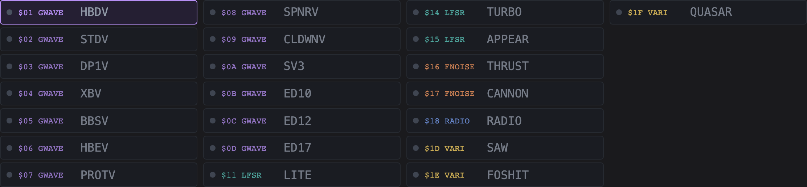
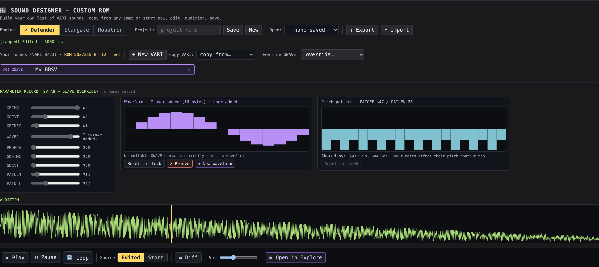
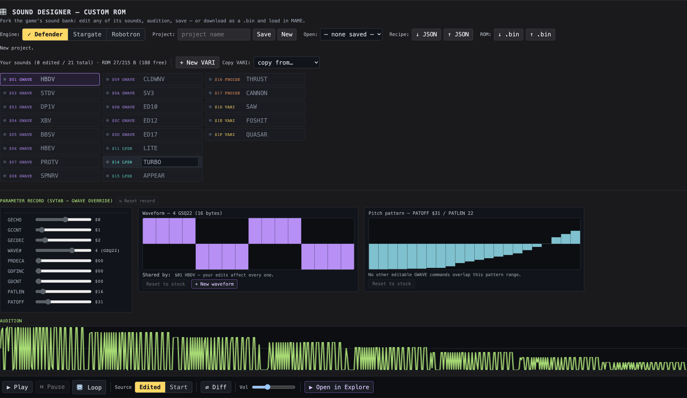
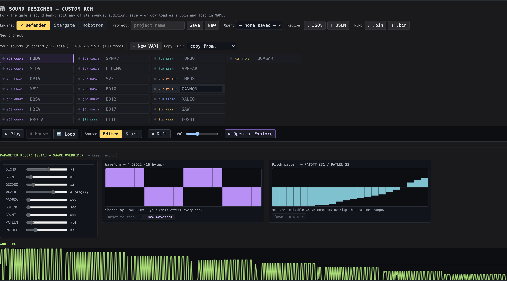
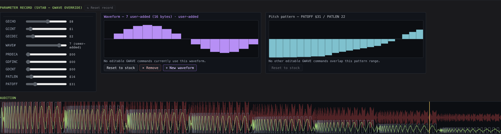
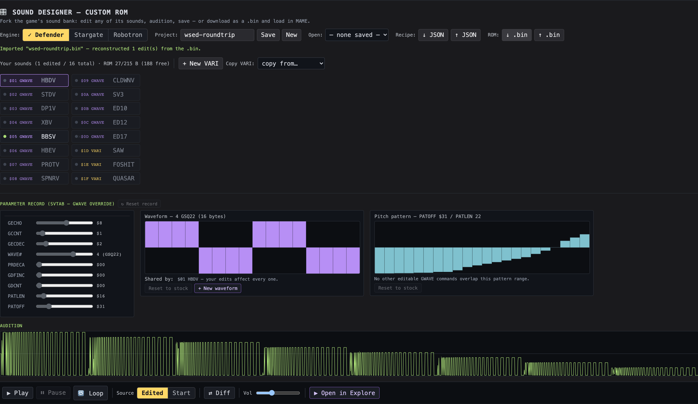

# Williams Sound Designer — Manual

> Build your own custom sound ROM in the explorer's **Design** mode (companion to the explorer's [`MANUAL.md`](MANUAL.md)). For *how it's built*, see [`docs/designer_implementation.md`](docs/designer_implementation.md).

  

## Quick start

1. Top of the page: click **Design** in the **Explore | Design ✎** switch. (Explore is untouched — Design is a separate surface.)
2. Pick an **engine base** — Defender, Stargate, or Robotron. The list fills with that game's editable sounds, one row per command.
3. **Click a sound** → its editor opens (sliders, and for GWAVE/RADIO a canvas).
4. Edit, then **▶ Play** to hear it. Save it as a JSON **recipe**, or **↓ .bin** to load in MAME / burn an EPROM.

You need at least one game ROM loaded (added on the Explore onboarding screen).

## What it is

A Williams arcade sound isn't a sample or an FM patch — it's a tiny **parameter record** a shared synthesis engine reads. The VARI engine, for instance, turns **nine bytes** into a swept square wave (that's all of SAW, FOSHIT, QUASAR…). Design mode lets you do what Sam Dicker did building a new Williams game: **fork the game's sound bank**, modify any sound (or add new ones), and save the result as a custom ROM.

It covers **all five of Williams's data-driven engines** — per-engine parity with the Defender Sound Studio, but across all three games and running the real ROMs. Two editing models:

- **VARI** adds *new* sounds at command codes `$1D`+ (the dispatcher has spare bits to widen).
- **GWAVE / LFSR / FNOISE / RADIO** *override an existing command in place* (their dispatchers are hardcoded — no spare codes).

## Engines at a glance

| Engine | Sounds (command codes) | Editor | Engine base |
|---|---|---|---|
| **VARI** | SAW `$1D`, FOSHIT `$1E`, QUASAR `$1F` (+ new at `$20`+) | 8 sliders | Defender, Stargate |
| **GWAVE** | `$01 HBDV` … `$0D ED17` | 9 sliders + waveform canvas + pitch canvas | all three |
| **LFSR** | LITE `$11`, TURBO `$14`, APPEAR `$15`, LAUNCH `$39` | 2–4 sliders (per sound) | all three |
| **FNOISE** | THRUST `$16`, CANNON `$17`, BG1 `$0F`, HBOMB `$3E` | up to 5 sliders | all three |
| **RADIO** | RADIO `$18` | FREQ slider + 16-cell wavetable canvas | all three |

⚠ **Robotron-only:** VARI editing needs Defender/Stargate (Robotron's dispatcher is non-linear); LFSR **LAUNCH** and FNOISE **BG1 + HBOMB** exist only on Robotron.

## The item list

*New Project* pre-populates the list with **every editable command** of the engine base — 22 on Defender (13 GWAVE + 3 LFSR + 2 FNOISE + 1 RADIO + 3 VARI), 22 on Robotron (the VARI rows swap for LAUNCH + BG1 + HBOMB). It flows into columns of 7, colour-coded by engine.

  

- **Dot** before each code: **grey** = stock (unchanged), **green** = edited (you've changed its bytes).
- **Colour tag:** VARI yellow · GWAVE purple · LFSR teal · FNOISE orange · RADIO blue.
- Header reads **"Your sounds (N edited / M total) · ROM X/Y B"** — edited count + the ROM-space budget.
- **Click a row** to edit it. **+ New VARI** / **Copy VARI** add extra VARI slots (`$20`+); user-added rows get an **✕**, stock rows don't (reload re-adds them — use ↻ Reset record instead).

## Editing a sound

Click a row; the editor swaps to match its engine. Every editor shares a **↻ Reset record** button (reverts the slot to its starting bytes; greyed out until you edit) and feeds the **audition** controls below the list.

### VARI — swept square wave

Eight sliders over the 9-byte VVECT record:

| Field | What it does |
|---|---|
| **LOPER / HIPER** | low- and high-cycle periods — together set duty cycle + pitch |
| **LODT / HIDT** | per-cycle sweep deltas (signed) |
| **HIEN** | threshold where the sweep stops |
| **SWPDT** | 16-bit countdown before the low-modulation kicks in |
| **LOMOD** | added to the low period after the sweep (signed) |
| **VAMP** | output amplitude |

*Try:* Copy **Defender SAW**, raise **LOPER** a lot → the zap stretches longer and drops in pitch.

### GWAVE — wavetable + pitch pattern

Nine SVTAB sliders, plus two click-to-draw canvases. (Bytes 0–1 are nybble-packed — two sliders share one byte.)

| Field | What it does |
|---|---|
| **GECHO / GCCNT** | echo count / cycles per note — shape rhythm + sweep speed |
| **GECDEC / WAVE#** | echo decay / which stock wave to start from (`0`=GS2 … `6`=GS1.7) |
| **PRDECA** | pre-decay of the RAM waveform copy (larger → the "math-error" timbre) |
| **GDFINC / GDCNT** | signed frequency-delta / samples between applications — glide pitch |
| **PATLEN / PATOFF** | pitch-pattern length / offset into GFRTAB |

  

- **Waveform canvas** (middle) — the bytes of the slot's current `WAVE#`. Click-and-drag to redraw (x = sample, y = 0..255). **Reset to stock** reverts it.
- **Pitch-pattern canvas** (right, teal) — the `PATLEN` bytes at `PATOFF` in GFRTAB. Drag to redraw the pitch contour.
- ⚠ **Shared bytes:** the 7 stock waveforms (and overlapping pattern ranges) are shared across commands — a **"Shared by:"** line names every sound your edit also changes.

**New waveforms.** Click **+ New waveform** to add a 16-byte wave at `WAVE#` 7+ (up to 9), seeded with a sine shape and immediately drawable. The build relocates GWVTAB into free ROM and re-points one instruction. The header's **ROM-space indicator** shows headroom (yellow < 20 B free, red = over) *before* you click; an over-budget add is rejected with a clear message. **× Remove** drops a user-added wave and re-clamps any slot that pointed at it.

  

### LFSR — shift-register noise

LFSR parameters are **immediate operands in the caller code**, not a table, so the slider set differs per sound (no canvas — the noise comes from the shift-register taps):

| Sound | Sliders |
|---|---|
| **LITE** | DFREQ (freq delta, signed), CYCNT (cycles between updates) |
| **APPEAR / LAUNCH** | DFREQ, LFREQ (start frequency), CYCNT |
| **TURBO** | CYCNT/NFFLG, DECAY, NFRQ1 (16-bit period — smaller = brighter), NAMP |

  

### FNOISE — filtered noise (slope-limited walk)

A **split personality** — Robotron stores all four sounds in a clean 6-byte `FNTAB` table (all five fields editable); Defender/Stargate bake them into caller code, only partially:

| Sound | Defender / Stargate | Robotron |
|---|---|---|
| **THRUST** | FMAX only | all 5 fields |
| **CANNON** | DSFLG, FDFLG, FMAX, SAMPC | all 5 fields |
| **BG1 / HBOMB** | — (not editable) | all 5 fields |

The five fields: **DSFLG** (distortion on/off), **LOFRQ** (initial low-freq latch), **FDFLG** (frequency-decay on/off), **FMAX** (max slope per step — brightness), **SAMPC** (16-bit samples between noise redraws — coarseness).

⚠ To edit **BG1** or **HBOMB**, switch the engine base to **Robotron** (Defender/Stargate hardcode them with no spare immediate). CANNON is shared verbatim between Defender and Robotron — editing it on either changes the same record.

  

### RADIO — wavetable whoosh

One **FREQ** slider + a **16-cell click-to-draw wavetable canvas** (blue). RADIO reads a 16-byte table (`RADSND`) at a climbing rate to make a rising whistled sweep — the "credit accepted" / hyperspace whoosh.

- **FREQ** — initial frequency + climb rate (lower = lower + slower; higher = brighter + faster).
- **Canvas** — the 16 wavetable bytes (drag to redraw).

  

## Audition & A/B

The **transport** sits directly below the item list. It plays the selected sound through the real emulator offline (faithful; long sounds capped at 5 s), drawing the DAC trace on the scope strip at the bottom of the editor.

| Control | Action |
|---|---|
| **▶ Play / ⏸ Pause** | play from the top / hold + resume |
| **🔁 Loop** | repeat continuously — edits update the loop live |
| **Source ⟨Edited │ Start⟩** | A/B your edits against the slot's starting record — flip mid-playback to compare by ear |
| **⇄ Diff** | overlay the start (grey ghost) + divergence (red) behind the live trace |

Editing any control **auto-replays** so you hear each change immediately; a playhead sweeps the scope and freezes on Pause.

  

## Open in Explore (pause, step, scrub)

The in-Design transport is a single offline render. For the *live* experience — pause, single-step, scrub, plus the spectrogram, byte-tape, RAM heatmap, and swimlane all reading your custom sound — click **▶ Open in Explore** (right end of the transport).

It builds your custom ROM, pushes it into Explore's worklet, fires the selected slot, and flips you to Explore. A purple **✎ Custom: ⟨project⟩** entry appears in the game switcher — that's the marker you're running a *custom* image. Click it to re-audition (it rebuilds from your current edits); click any stock game to drop back.

  

## Save / share / export

Three channels, different trade-offs:

| Channel | What | Use it for |
|---|---|---|
| **Save** | project → browser (IndexedDB); reopens from **Open** | keep working locally |
| **Recipe: ↓ / ↑ JSON** | sparse recipe file — names + parameter values only | **sharing** (zero ROM bytes; reconstituted against the recipient's base ROM) |
| **ROM: ↓ / ↑ .bin** | full custom ROM image (`{project}_{engine}.bin`) | **running** — load in MAME (replace the matching `*_sound.bin`) or burn an EPROM; upload back to keep editing |

⚠ The `.bin` contains the original Williams ROM bytes with your edits — **personal use, don't redistribute** (the JSON recipe is the shareable artefact).

  

## Try these

- **Copy SAW twice**, give each a different **HIDT** (small vs large) → A/B by clicking each: the larger HIDT sweeps faster.
- Edit any sound, then toggle **Source: Start** + **⇄ Diff** → see exactly how far your edit moved it from stock.
- Override **GWAVE `$05 BBSV`**, redraw its waveform canvas, and watch the **"Shared by:"** line — then **Open in Explore** to hear it on the live worklet.

## Keyboard shortcuts

Design has its own minimal keymap (Explore's bindings don't fire while authoring). The **Play** / **Pause** buttons also show their key on hover.

| Key | Action |
|---|---|
| <kbd>Space</kbd> | Play the selected slot from the top |
| <kbd>P</kbd> | Pause / Resume |

Ignored while you're typing in a text field. Explore's full keymap is in [`MANUAL.md`](MANUAL.md) §*Keyboard shortcuts* and resumes when you flip back.

## How it compares to the original "Sound Designer"

The closest prior art is msarnoff's **[Defender Sound Studio](https://zapspace.net/defender_sound/)** (2020) — see [`docs/sound_studio_reference.md`](docs/sound_studio_reference.md). It pioneered *tweak a Williams sound in the browser and hear it*; we reuse two of its ideas (labelled parameter controls with tooltips, JSON import/export). The differences:

| | Defender Sound Studio (2020) | WSED |
|---|---|---|
| **How sounds run** | each routine hand-ported to JavaScript | the **real ROM bytes** on a cycle-accurate 6802 emulator |
| **Games** | Defender only | **Defender + Stargate + Robotron**, one surface |
| **Saved artefact** | JSON preset | JSON recipe (shareable, zero ROM bytes) **and** a runnable `.bin` |
| **Round-trip** | edit → play in browser | edit → play → **↓ .bin → MAME / EPROM → ↑ .bin** → keep editing |
| **Explore vs Design** | tweak-and-play only | a separate **Explore** mode (byte-tape, swimlane, engine state, RAM heatmap, spectrogram, scrub, step) — **Open in Explore** runs your custom ROM through it |
| **A/B + diff** | — | **Source: Edited│Start** + a **Diff** scope overlay |

**Engine coverage.** The Studio's 6 editable tabs map to **5 engines** in WSED's taxonomy (it splits LFSR across three tabs). WSED edits **all five**:

| Engine | Studio tab(s) | WSED |
|---|---|---|
| GWAVE | G-wave | ✅ |
| VARI | Pulses | ✅ |
| LFSR | Square noise + Player shoot | ✅ |
| FNOISE | Smooth noise | ✅ |
| RADIO | Sweeps | ✅ |
| SCREAM / HYPER | parameterless tabs | ❌ — needs an assembler (same blocker for both) |
| ORGAN pitch | n/a | ❌ — self-modifying code |

**Score: 5 / 5 — per-engine parity on Defender**, across three games and the actual ROMs. (On Defender/Stargate, FNOISE's **BG1** is the one sound WSED can't edit as data; the Studio reaches it only via its JS hand-port.)

## Limits

- **SCREAM, HYPER, ORGAN-pitch** aren't data-authorable — no preset record in the ROM, so editing them needs an in-browser 6800 assembler WSED deliberately doesn't ship.
- **Robotron as a VARI engine base** is a future item (its dispatcher is non-linear).
- For pause/step/scrub on a custom sound, use **Open in Explore**.
