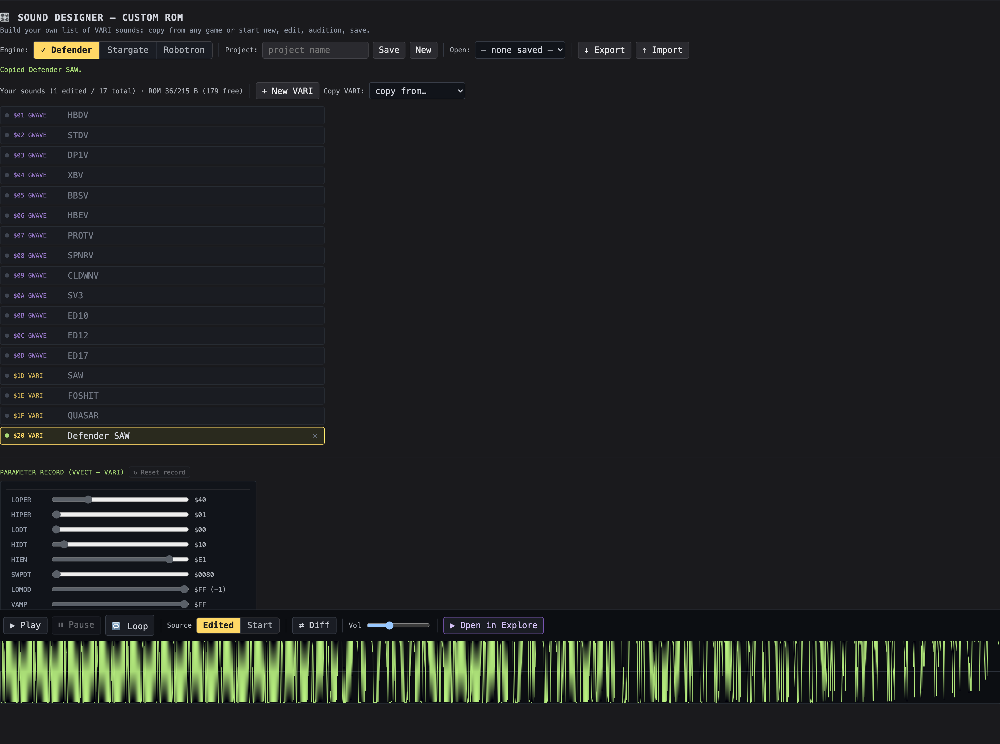
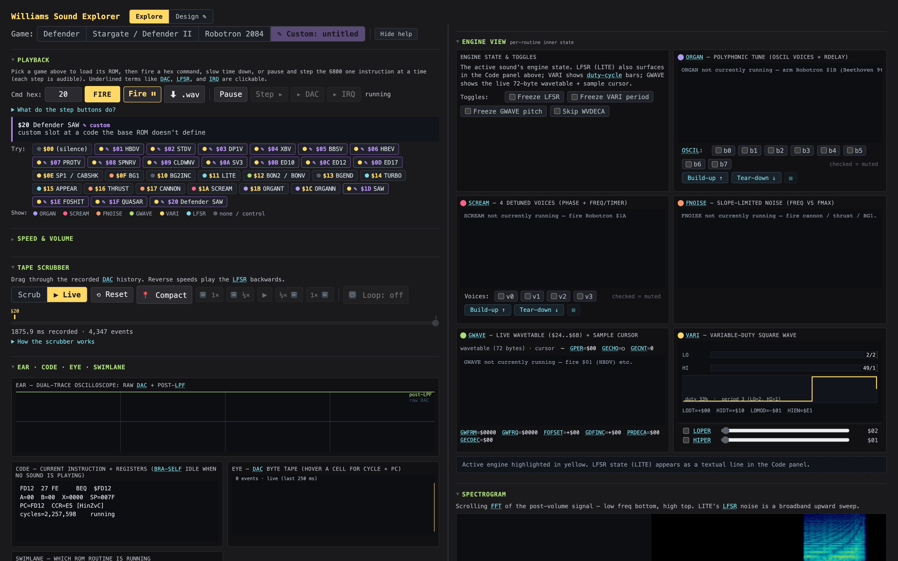

# Williams Sound Designer — Manual

> How to build your own custom sound ROM in the explorer's **Design** mode (the companion to the explorer's [`MANUAL.md`](MANUAL.md)). For *how it's built*, see [`docs/designer_implementation.md`](docs/designer_implementation.md).

  

## What it is

A Williams arcade sound isn't a sample or an FM patch — it's a tiny **parameter record** that a shared synthesis engine reads. The VARI engine, for instance, turns just **nine bytes** into a swept variable-duty square wave (that's the whole of SAW, FOSHIT, QUASAR…). Design mode lets you do what Sam Dicker did when building a new Williams game: **fork the game's sound bank**, modify any of its sounds (or add new ones), and save the result as a custom ROM.

This covers the **VARI** and **GWAVE** engines. VARI slots are *new sounds* added at command codes `$1D`+ (the engine's dispatcher has spare bits we widen); GWAVE slots *override* an existing GWAVE command's parameter record in place (GWAVE's dispatcher is hardcoded — no spare codes — so the model differs).

## Getting in

At the top of the page there's an **Explore | Design ✎** switch. Click **Design**. (Explore mode is completely unchanged — Design is a separate surface.)

You need at least one of the game ROMs loaded:

- For **VARI** sounds (new sounds at codes `$1D`+), Defender or Stargate; Robotron's VARI dispatcher is too non-linear to grow.
- For **GWAVE** overrides (replacing an existing GWAVE command's record), any of the three games — Defender, Stargate, or Robotron.

ROMs are added on the Explore onboarding screen.

## The workflow

1. **Engine** — pick **Defender**, **Stargate**, or **Robotron**: which game's engine code your custom ROM runs on. VARI slots only work on Defender / Stargate (Robotron's VARI dispatch is non-linear); GWAVE slots work on every base. A record copied from any game plays the same — the engine is identical across games.
2. **The list opens with the game's sound bank already loaded.** *New Project → Defender* pre-populates the item list with every editable command — 13 GWAVE rows (`$01 HBDV` … `$0D ED17`) plus 3 VARI rows (`$1D SAW` / `$1E FOSHIT` / `$1F QUASAR`), 16 in total. Stargate is the same; Robotron has 13 GWAVE rows (no VARI). Each row carries a **● dot indicator** before its code:
   - **Grey dot** + dimmed name = **stock** (unchanged from the base ROM).
   - **Green dot** + bright name = **edited** (you've changed its bytes; ↻ Reset record brings it back to stock).
   The header reads *"Your sounds (N edited / M total)"* so you see at a glance how many of the game's commands you've touched. Click any row to edit it.
3. **Add new sounds beyond the base game's set** — the **+ New VARI** and **Copy VARI:** controls still add **extra** VARI slots at the next free code (`$20`, `$21`, …):
   - **+ New VARI** adds a sound (seeded from the base game's SAW as a starting point), capped at the engine's VVECT capacity: **23** on Defender, **30** on Stargate.
   - **Copy VARI:** adds a sound copied from any loaded game's VARI catalogue — `SAW` / `FOSHIT` / `QUASAR` (Defender/Stargate), `MOSQTO` (Robotron).
   - User-added rows get an **✕** to remove them; stock rows can't be removed (a reload would re-add them anyway — use ↻ Reset record on the editor instead).
   - VARI rows show yellow `$XX VARI`; GWAVE rows show purple `$XX GWAVE`.
4. **Edit the parameter record** — drag the sliders. For VARI slots:
   - **LOPER / HIPER** — the low- and high-cycle periods; together they set the duty cycle and pitch.
   - **LODT / HIDT** — how fast each period sweeps (signed).
   - **HIEN** — the threshold where the sweep stops.
   - **SWPDT** — a 16-bit countdown before the low-modulation kicks in.
   - **LOMOD** — added to the low period once the sweep finishes (signed).
   - **VAMP** — output amplitude.

   For **GWAVE** slots the panel switches to nine SVTAB fields (the editor label reads "Parameter record (SVTAB — GWAVE override)"). Bytes 0 and 1 are nybble-packed — what looks like two sliders per byte is one byte underneath:

   - **GECHO** / **GCCNT** — echo count (how many decayed plays after the first) / cycles per frequency note. Together they shape rhythm + sweep speed.
   - **GECDEC** / **WAVE#** — echo decay (amplitude drop per echo, in 1/16ths) / which of the 7 stock waves to start from (`0`=GS2 through `6`=GS1.7).
   - **PRDECA** — pre-decay factor applied to the RAM waveform copy at load (0 = no decay; larger wraps mod-256 to produce the characteristic "math-error" timbre).
   - **GDFINC** / **GDCNT** — signed frequency-delta increment / how many samples between applications. Together they glide pitch.
   - **PATLEN** / **PATOFF** — pitch-pattern length + offset into GFRTAB (which existing pattern you point at).

   To the right of the SVTAB sliders, a **waveform canvas** (Step 2 of the GWAVE editor) shows the resolved bytes of the slot's current `WAVE#` — switch the `WAVE#` slider and the canvas re-renders to the new waveform. Click-and-drag to redraw the bytes (each x-cell = one sample, y = amplitude 0..255). The length doesn't change — Step 2 only rewrites bytes in place, so it doesn't shift any pointers.

   A **"Shared by:"** line under the canvas lists every editable GWAVE command currently pointing at this `WAVE#` (e.g. *"Shared by: $05 BBSV, $0D ED17 — your edits affect every one."*). Each of the 7 stock waveforms (GS2 / GSSQ2 / GS1 / GS12 / GSQ22 / GS72 / GS1.7) is shared across whichever ROM commands happen to use it — redrawing it changes every one of those sounds. The **Reset to stock** button reverts your edits for this `WAVE#` (it's greyed out until you actually edit).

   Beside the waveform canvas is a **pitch-pattern canvas** (Step 3 of the GWAVE editor) — teal bars showing the `PATLEN` bytes starting at `PATOFF` in `GFRTAB`. Click-and-drag redraws the pitch contour byte by byte. Patterns are addressed by *raw offset+length* (not by index like waveforms), so two slots whose pattern ranges happen to overlap share those bytes — its **"Shared by:"** line names the other editable commands whose pattern range overlaps yours, so you know what else your edits touch. The **Reset to stock** button below the pattern canvas clears the project's override at this `PATOFF` (greyed out until you edit). When `PATLEN = 0` (no pitch sweep), the canvas shows an empty-state message instead of bars.

   For **brand-new waveforms** (not in the 7 stock waves), click **+ New waveform** below the waveform canvas (Step 4 of the GWAVE editor). A new 16-byte waveform is added to your project at the next available `WAVE#` index (starting at 7), seeded with a sine-like shape; the slot's `WAVE#` slider auto-switches to it, and you can immediately edit the bytes via the canvas. **A custom ROM with added waveforms relocates the whole GWVTAB into the free RADIO/ORGAN region of the ROM and re-points the `LDX #GWVTAB` instruction at the new location** — one byte of code patching unlocks up to **9 new waveforms** (the WAVE# nybble's remaining slots), with the limit decreasing as your project grows in VARI slots. The header bar carries a live **ROM-space indicator** (`· ROM X/Y B (N free)` next to the item count) so you can see the headroom *before* you press the button: it glows yellow under 20 bytes free and red when you're already over budget. If the layout won't fit, the **+ New waveform** click is rejected with a clear status-line message (`Can't add waveform — Won't fit … over by N bytes`) and the project stays untouched. To drop a user-added wave once added, switch the slot's `WAVE#` to it and click **× Remove** beside the canvas — any slot whose `WAVE#` pointed at the removed entry resets to stock `$06`, and slots that pointed at a higher idx shift down by one (entries above the removed wave move down to fill the gap).

   Across both canvases, **lengths never change in this version** — the canvas always covers exactly what the kernel reads, with the same byte offsets. That keeps the ROM's pointer math (GWLD waveform walk + SVTAB `PATOFF`) valid without any rebase pass.

   At the right end of the editor's label row sits a **↻ Reset record** button — clicking it reverts the slider values to the slot's starting bytes (what was copied/created when the slot was added; this is the same reference the **Source: Start** transport toggle plays). It's greyed out until you actually edit, and works for both VARI and GWAVE editors. The waveform and pitch-pattern canvases have their own **Reset to stock** buttons — *those* clear per-canvas overrides; **↻ Reset record** only touches the parameter record (sliders).
5. **Audition** — a thin scope strip below the editor renders the offline-rendered DAC trace; the **transport** bar below it (which sticks to the bottom of the viewport, so it's always reachable even on shorter windows) carries:
   - **▶ Play** plays the selected sound from the top; **⏸ Pause** holds / **▶ Resume** (sounds can run several seconds).
   - **🔁 Loop** repeats continuously — edits update the loop live, so you can tweak-and-listen hands-free.
   - **Source: ⟨Edited │ Start⟩** A/Bs your edits against the sound's starting point (its record when copied/created); flip it mid-playback to compare by ear.
   - **⇄ Diff** toggles an overlay of the starting point (grey) + divergence (red) behind the live trace, without interrupting audio.
   - A **playhead** sweeps the scope in time with playback and freezes on Pause; **editing any slider auto-replays** so you hear each change immediately.
   (Audition runs the actual custom ROM image through the real emulator offline — what you hear is faithful. Very long sounds are capped at 5 seconds.)
6. **Save / share** —
   - Name the project and click **Save** — it persists in your browser (IndexedDB) and reappears in **Open**. **The saved project is sparse:** only your edits are stored (stock rows are reconstructed from the engine base when you re-open). That keeps the recipe small and ensures the saved artefact carries **zero copyrighted ROM bytes**.
   - **⬇ JSON** downloads the same sparse recipe as a file; **⬆ JSON** loads one back. Safe to share — the file is just your sounds' names + parameter values.

## Auditioning in Explore (pause, step, scrub)

The in-Design transport plays your sound as a single offline render — fine for a quick listen, but the scope only shows the rendered float buffer. For the *live* experience — pause, single-step, scrub, the spectrogram, the DAC byte-tape, the RAM heatmap, the swimlane, all reading your custom sound — click **▶ Open in Explore** (the purple button at the right end of the sticky transport bar).

What happens: the app builds your custom ROM image, pushes it into Explore's worklet, fires the selected slot, and flips you back to Explore. The game switcher gains a new **✎ Custom: ⟨project name⟩** entry (in purple, to set it apart from the three stock ROMs) — that's the marker that you're auditioning a *custom* image rather than the original Williams ROM. Click any base game button to drop back to that stock ROM; click the **Custom** entry to come back to your audition (it rebuilds from your *current* Design-mode project, so edits made in between are picked up).

  

## Keyboard shortcuts

Design has its own minimal keymap so Explore's bindings don't interfere while you're authoring — pressing <kbd>Space</kbd> here triggers Design's Play, not Explore's Fire.

| Key | Action |
|---|---|
| <kbd>Space</kbd> | Play the selected slot from the top |
| <kbd>P</kbd> | Pause / Resume |

Shortcuts are ignored while you're typing in the project name, slot name, or any other text input. Explore's full keymap (Fire, scrub, single-step, game-cycle, …) is documented in [`MANUAL.md`](MANUAL.md) §*Keyboard shortcuts* and reactivates the moment you flip back to Explore.

## Good first experiments

- **+ Copy from… Defender SAW**, then raise **LOPER** a lot → the zap stretches longer and drops in pitch (you'll hit the 5 s cap).
- Copy SAW twice; on one, swap **HIDT** between small and large → changes how fast it sweeps. A/B them by selecting each.
- Use **Source ⟨Edited│Start⟩** + **Diff** to see exactly how far your edits moved a sound from where it started.

## How it compares to the original "Sound Designer"

The closest prior art is msarnoff's **[Defender Sound Studio](https://zapspace.net/defender_sound/)** (2020) — see [`docs/sound_studio_reference.md`](docs/sound_studio_reference.md). It pioneered the idea of *tweak a Williams sound's parameters in the browser and hear it*, and we deliberately reuse two of its good ideas: **labelled parameter controls with in-place tooltips**, and **JSON preset import/export**. Where this mode differs:

| | Defender Sound Studio (2020) | Design mode here |
|---|---|---|
| **How sounds run** | each ROM routine hand-ported to JavaScript | the **real ROMs** on a cycle-accurate 6802 emulator (bit-faithful) |
| **Games** | Defender only | Defender, Stargate, **and** Robotron |
| **What you make** | tweak one handler's existing preset | your **own custom ROM** — copy/new VARI sounds in your **own named item list**, at **new command codes** |
| **Editing** | numeric inputs + tooltips | sliders + tooltips (same idea) |
| **Comparing** | — | **A/B** (Edited vs Start) + a visual **Diff** overlay |
| **Seeing** | oscilloscope + FFT | + DAC byte-tape, routine swimlane, LFSR/engine state, RAM heatmap, spectrogram, scrub, single-step — via **Open in Explore** the custom ROM runs in Explore's live pipeline |
| **Saving** | JSON preset | JSON recipe — **zero ROM bytes**, reconstituted against your own ROM |

In short: the Studio *tweaks* one game's existing sounds with a JS re-implementation; this builds a **new custom ROM** of sounds across all three games on the actual emulated hardware.

## Limits

VARI only, on a **Defender/Stargate** engine base. You can't yet copy/edit the other engines (GWAVE wavetables, SCREAM, ORGAN tunes) or use Robotron as the engine base — those are planned follow-ups (see [`docs/designer_implementation.md`](docs/designer_implementation.md)). For pause/step/scrub on a custom sound, use **Open in Explore** above.
