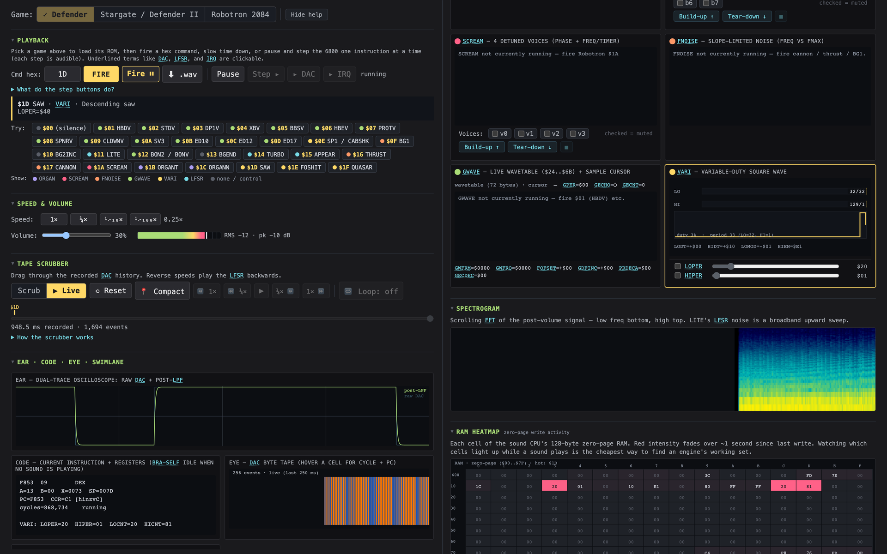
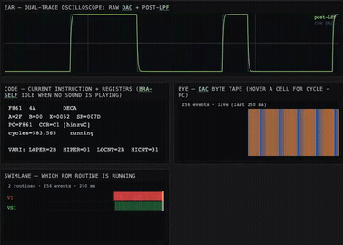

# Williams Sound Explorer

<h1 align="center">
  <a href="https://mbackschat.github.io/williams-sound-explorer/">▶ RUN IN YOUR BROWSER →</a>
</h1>

<p align="center">
  <a href="https://mbackschat.github.io/williams-sound-explorer/">
    
  </a>
</p>

<p align="center">
  <em>No install. You supply your own Williams sound ROMs (read in your browser, never uploaded), then explore the algorithms at slow motion. Works in Chrome and Firefox.</em>
</p>

   [](https://mbackschat.github.io/williams-sound-explorer/)

A browser-based explorer for the arcade **sound effects** of **Defender** (1980),
**Stargate / Defender II** (1981), and **Robotron 2084** (1982). Every sound on
those cabinets is a tiny program running on a Motorola 6802 that streams bytes to
an 8-bit DAC. This tool emulates that sound CPU and makes the algorithms **visible**
(oscilloscope, spectrogram, DAC byte-tape, per-engine state, RAM heatmap) and
**audible** at human-scale time — from 1× down to single-instruction stepping.
Drive it by mouse or keyboard — `Space` fires, `1`–`4` set speed, `←/→` scrub or
single-step, `G` cycles game, and `?` lists every shortcut.

<p align="center">
  
</p>

<p align="center">
  <br>
  <em>Defender's descending SAW at ¼× — the oscilloscope, live 6800 disassembly, DAC byte-tape, and routine swimlane update in lockstep.</em>
</p>

> ⚠️ **You must supply your own ROMs.** This project does **not** include the
> Williams sound ROMs — they are © Williams Electronics. On first run the app
> asks you to upload them; the files stay in your browser (IndexedDB) and are
> never sent anywhere. See [Supplying ROMs](#supplying-roms).

## Quick start

```bash
cd explorer
npm install
npm run dev          # → http://localhost:5173
```

On first run an **onboarding screen** asks for the Williams *sound* ROM of each
game. Drop a file on a slot — the app validates it (size + 6802 vectors + a
SHA-1 allowlist) and stores it locally. The explorer works with **as few as one**
ROM; games without one stay locked until you add them.

## Supplying ROMs

The sound ROM for each game is a small chip image (2 KB for Defender/Stargate,
4 KB for Robotron). Obtain them from a source you're entitled to use:

- a **MAME romset** you are licensed to use (the sound ROM is inside the game's
  zip — the app verifies it and tells you which game it is), or
- a **dump from your own board**, or
- **build them from source** (see below).

Nothing is uploaded; ROMs live only in your browser's IndexedDB. Use **Remove**
on a slot to delete one.

## Building ROMs from source (optional)

The assemble-from-source toolchain is included, but the **Williams sound source
is not** (it is copyrighted). To rebuild the ROMs yourself:

1. Obtain the Williams sound source and place it at `research/williams-soundroms/`
   (`VSNDRM1.SRC` … for Defender/Stargate/Robotron).
2. Install the `vasm` 6800 assembler — see [`docs/vasm_install_notes.md`](docs/vasm_install_notes.md).
3. Run `tools/build_roms.sh` → produces `research/roms/*_sound.bin`.
4. `cd explorer && npm run dev:roms` copies them into the gitignored
   `public/roms/` so the app auto-loads them and skips onboarding.

## What's inside

| Path | What |
|---|---|
| `explorer/` | The TypeScript app (Vite + plain TS + canvas). 6802 emulator, PIA, synth, AudioWorklet pipeline, all the visualizations. |
| `tools/` | Assembler toolchain (`build_roms.sh`, preprocessor) + data generators (glossary, label map, explainer cards, zero-page map). |
| `docs/` | Curated reference: hardware model, the 8 synthesis primitives, per-game command catalogues, pedagogical design, architecture. Start at [`docs/00_INDEX.md`](docs/00_INDEX.md). |
| [`MANUAL.md`](MANUAL.md) | User manual — 12 tutorials + interface tour. |

## Sound Designer

Beyond exploring, the app has a separate **Design** mode (the **Explore | Design** toggle in the header) for building your **own custom ROM** of VARI sounds: pick an engine base, copy any game's sound or add a new one into your own named list, edit its 9-byte parameter record with sliders, audition + A/B, and save as a JSON recipe (no ROM bytes). See [`docs/designer_guide.md`](docs/designer_guide.md).

It's inspired by msarnoff's **Defender Sound Studio** (2020) and reuses its labelled-parameter and JSON-export ideas, but goes further: it runs the **real ROMs on the cycle-accurate emulator** (not a per-routine JavaScript hand-port), covers **all three games** (not just Defender), and lets you author **new sounds at new command codes** — a genuine custom ROM — rather than only tweaking existing presets.

## Development

```bash
cd explorer
npm test             # Vitest
npm run typecheck    # strict tsc --noEmit
npm run build        # production bundle → explorer/dist  (no ROM bytes)
```

## License

MIT — see [`LICENSE`](LICENSE). The MIT license covers the explorer app, the
build tooling, and the documentation. It does **not** cover the Williams sound
ROMs (© Williams Electronics, not included), nor the third-party `vasm`
assembler and npm dependencies, which keep their own licenses.

The names *Defender*, *Stargate*, *Robotron 2084*, and *Williams* are used
descriptively to identify the games whose sound code is analyzed here; no
affiliation or endorsement is implied.
